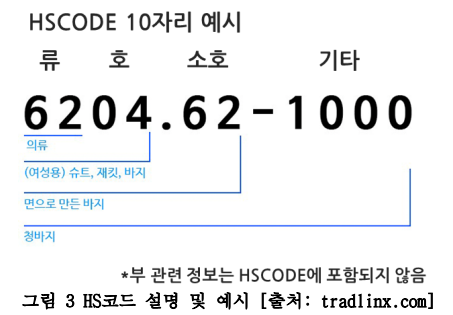

## 🚢 sentence-transformers를 활용한 HSCODE 자동 추천
* HSCODE는 수출 물품의 품목 분류 코드
* 기업은 통관절차를 밟기 위해 관세사에 화물의 HSCODE를 전달 해야함.
* 하지만 11,000개가 넘는 HSCODE표를 일일이 확인하는 작업은 시간적 비용이 매우 큼
* sentence-transformers, cosine simirality를 활용해 HSCODE 자동 추천 시스템을 개발



## 추천 시스템 알고리즘


## HSCODE 데이터 수집 및 임베딩 추출

```bash
python3 craw_data.py
```
selenium 라이브러리를 활용 관세법령정보포털에서 약 51,000개의 HSCODE-품명 쌍 데이터 수집

```bash
python3 embedding.py
```
[sentence-transformers](https://huggingface.co/sentence-transformers/all-MiniLM-L6-v2)를 활용해 품목명 임베딩 벡터 추출 및 임베딩 파일 생성

## 추천 예시
```bash
python3 recommend.py
```

