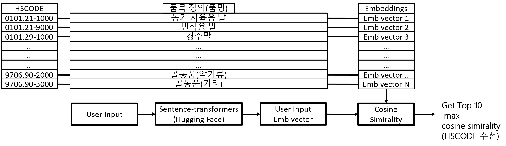
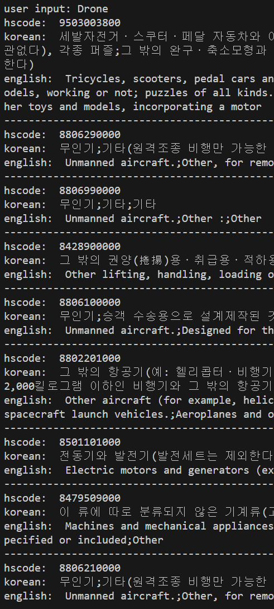

## 🚢 sentence-transformers를 활용한 HSCODE 자동 추천
* HSCODE는 수출 물품의 품목 분류 코드
* 기업은 통관절차를 밟기 위해 관세사에 화물의 HSCODE를 전달 해야함.
* 하지만 11,000개가 넘는 HSCODE표를 일일이 확인하는 작업은 시간적 비용이 매우 큼
* sentence-transformers, cosine simirality를 활용해 HSCODE 자동 추천 시스템을 개발

## 추천 시스템 알고리즘


* HSCODE-품명쌍 데이터 수집후, sentence-transformers 모델을 통해 embedding 벡터 추출.
* 최종적으로 HSCODE-품명-embedding 파일 생성 후 User-input이 들어올 경우 embedding 파일내의 embedding vector와 Cosine-simirality 계산 후 추천
## HSCODE 데이터 수집 및 임베딩 추출

```bash
python3 craw_data.py
```
selenium 라이브러리를 활용 관세법령정보포털에서 약 51,000개의 HSCODE-품명 쌍 데이터 수집.
실제 관세법령정보포털에서 정의하는 HSCODE와 그에따른 품명은 13,000개 정도지만 실제 품목 분류 사례 데이터도 추가해 총 51,000개 수집


```bash
python3 embedding.py
```
[sentence-transformers](https://huggingface.co/sentence-transformers/all-MiniLM-L6-v2)를 활용해 품목명 임베딩 벡터 추출 및 임베딩 파일 생성

## 임베딩 파일 예시
```
{
  "0":[
    "0101211000",
    "Live horses, asses, mules and hinnies.;Pure-bred breeding animals;For farm breeding",
    "살아 있는 말ㆍ당나귀ㆍ노새ㆍ버새;번식용;농가 사육용",
    [
      -0.05175447091460228,
      0.012477589771151543,
      -0.014086587354540825,
      0.07823598384857178,.....
    ]]
    ....
  "51436": [
    "9601100000",
    "Ivory rod",
    "",
    [
      -0.04398563131690025,
      0.0625043660402298,
      -0.06562592089176178,
      0.036785226315259933,
      0.016110677272081375,
      0.0722077414393425, ....
    ]]
}

emb.pickle
```
* [HSCODE, 영문 품목명, 한글 품목명, 임베딩 벡터] 순으로 데이터 저장

```
{
  "101200000": [
    "살아 있는 말ㆍ당나귀ㆍ노새ㆍ버새;말",
    "Live horses, asses, mules and hinnies.;Horses :"
  ],
  "101210000": [
    "살아 있는 말ㆍ당나귀ㆍ노새ㆍ버새;말;번식용",
    "Live horses, asses, mules and hinnies.;Horses :;Pure-bred breeding animals"
  ],
  "101211000": [
    "살아 있는 말ㆍ당나귀ㆍ노새ㆍ버새;말;번식용;농가 사육용",
    "Live horses, asses, mules and hinnies.;Horses :;Pure-bred breeding animals;For farm breeding"
  ],
  ....
  "9706901000": [
    "골동품(제작 후 100년을 초과한 것으로 한정한다);기타;도자기류",
    "Antiques of an age exceeding 100 years.;Other;Ceramics"
  ],
  "9706902000": [
    "골동품(제작 후 100년을 초과한 것으로 한정한다);기타;악기류",
    "Antiques of an age exceeding 100 years.;Other;Musical instruments"
  ],
  "9706903000": [
    "골동품(제작 후 100년을 초과한 것으로 한정한다);기타;기타",
    "Antiques of an age exceeding 100 years.;Other;Other"
  ]
}

hscode.pickle
```
* emb.pickle을 통해 hscode 추출후, 관세법령정보포털에서 정의한 실제 hscode 품목명을 hscode.pickle 파일을 통해 출력.

## 추천 예시
```bash
python3 recommend.py
```

## 성능 평가

* 실제 품목 사례중 일부를 test 데이터로 분리해 성능 평가.


* 성능 metric은 그림과 같음
* 10자리 기준 accuracy는 82%,
* 6자리 기준 accuracy는 86%
* 4자리 기준 accuracy는 91% 
## Reference
```
@article{
  title={단어 임베딩을 활용한 빅데이터 기반의 지능형 HS코드 식별},
  author={Hyo-Chang Woo,Young-Koo Lee}
  journal={한국정보과학회 학술발표논문집}
  year = {2019} 
}
@article{
  title={언어모델 전이학습 기반 해외 직접 구매 상품군 분류},
  author={Kyo-Joong Oh,Ho-Jin Choi,Wonseok Cha,Ilgu Kim,Chankyun Woo}
  journal={한글 및 한국어 정보처리 학술대회 논문집}
  year = {2022} 
}
```
* [HS 오토팬](https://www.hs-tariff.com/main/hs_mti_ai_main/?device=pc)
* [Cello Square(첼로 스퀘어)](https://www.cello-square.com/kr-ko/index.do)
* https://huggingface.co/nreimers/MiniLM-L6-H384-uncased
* https://huggingface.co/sentence-transformers/all-MiniLM-L6-v2
* [관세법령정보포털](https://unipass.customs.go.kr/clip/index.do)
